# Step by Step Guide - ENG

## Requirements

In order to execute the Hands On Labs you need:
* A Spark 3 and Iceberg-enabled CDE Virtual Cluster (Azure, AWS and Private Cloud ok).
* No script code changes are required other than entering your Storage Bucket and Credentials at the top of each script.
* Familiarity with Python and PySpark is highly recommended.
* The files contained in the data folder should be manually loaded in the Storage Location of choice. If you are attending a CDE ACE Workshop, this will already have been done for you. Please validate this with your Cloudera Workshop Lead.  
* Bonus Lab 1 requires a Hive CDW Virtual Warehouse. This lab is optional.

## Project Setup

Clone this GitHub repository to your local machine or the VM where you will be running the script.

```
mkdir ~/Documents/cde_ace_hol
cd ~/Documents/cde_ace_hol
git clone https://github.com/pdefusco/CDE_Tour_ACE_HOL.git
```

Alternatively, if you don't have `git` installed on your machine, create a folder on your local computer; navigate to [this URL](https://github.com/pdefusco/CDE_Tour_ACE_HOL.git) and manually download the files.

## Introduction to the CDE Data Service

Cloudera Data Engineering (CDE) is a serverless service for Cloudera Data Platform that allows you to submit batch jobs to auto-scaling virtual clusters. CDE enables you to spend more time on your applications, and less time on infrastructure.

Cloudera Data Engineering allows you to create, manage, and schedule Apache Spark jobs without the overhead of creating and maintaining Spark clusters. With Cloudera Data Engineering, you define virtual clusters with a range of CPU and memory resources, and the cluster scales up and down as needed to run your Spark workloads, helping to control your cloud costs.

The CDE Service can be reached from the CDP Home Page by clicking on the blue "Data Engineering" icon.

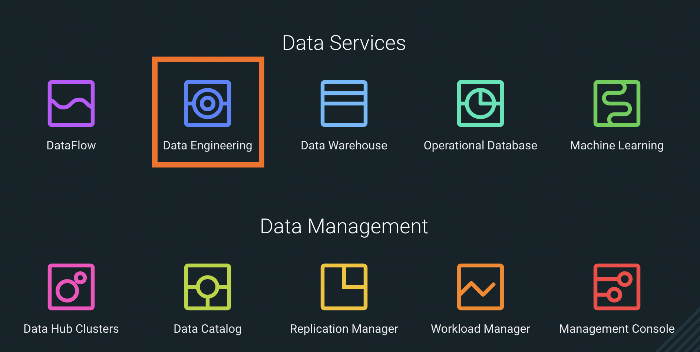

The CDE Landing Page allows you to access, create and manage CDE Virtual Clusters. Within each CDE Virtual Cluster you can  create, monitor and troubleshoot Spark and Airflow Jobs.

The Virtual Cluster is pegged to the CDP Environment. Each CDE Virtual Cluster is mapped to at most one CDP Environment while a CDP Environment can map to one or more Virtual Cluster.

These are the most important components in the CDE Service:

##### CDP Environment
A logical subset of your cloud provider account including a specific virtual network. CDP Environments can be in AWS, Azure, RedHat OCP and Cloudera ECS. For more information, see [CDP Environments](https://docs.cloudera.com/management-console/cloud/overview/topics/mc-core-concepts.html). Practically speaking, an environment is equivalent to a Data Lake as each environment is automatically associated with its own SDX services for Security, Governance and Lineage.

##### CDE Service
The long-running Kubernetes cluster and services that manage the virtual clusters. The CDE service must be enabled on an environment before you can create any virtual clusters.

##### Virtual Cluster
An individual auto-scaling cluster with defined CPU and memory ranges. Virtual Clusters in CDE can be created and deleted on demand. Jobs are associated with clusters.

##### Jobs
Application code along with defined configurations and resources. Jobs can be run on demand or scheduled. An individual job execution is called a job run.

##### Resource
A defined collection of files such as a Python file or application JAR, dependencies, and any other reference files required for a job.

##### Job Run
An individual job run.

##### CDE User Interface

Now that you have covered the basics of CDE, spend a few moments familiarizing yourself with the CDE Landing page.

The Home Page provides a high level overview of all CDE Services and Clusters. At the top, you have shortcuts to creating CDE Jobs and Resources. Scroll down to the CDE Virtual Clusters section and notice that all Virtual Clusters and each associated CDP Environment / CDE Service are shown.

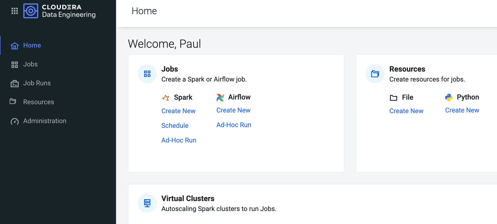

Next, open the Administration page on the left tab. This page also shows CDE Services on the left and associated Virtual Clusters on the right.

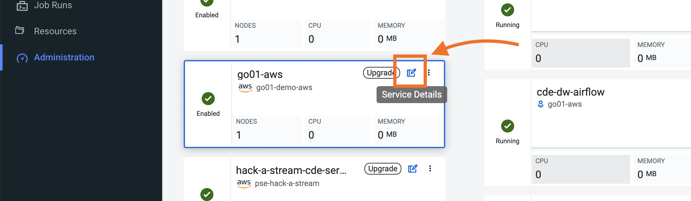

Open the CDE Service Details page and notice the following key information and links:

* CDE Version
* Nodes Autoscale Range
* CDP Data Lake and Environment
* Graphana Charts. Click on this link to obtain a dashboard of running Service Kubernetes resources.
* Resource Scheduler. Click on this link to view the Yunikorn Web UI.

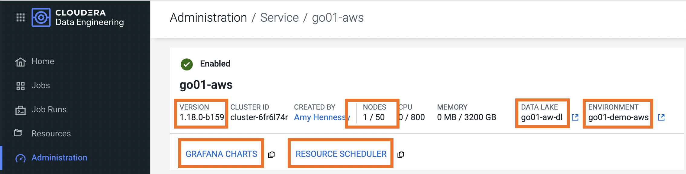

Scroll down and open the Configurations tab. Notice that this is where Instance Types and Instance Autoscale ranges are defined.

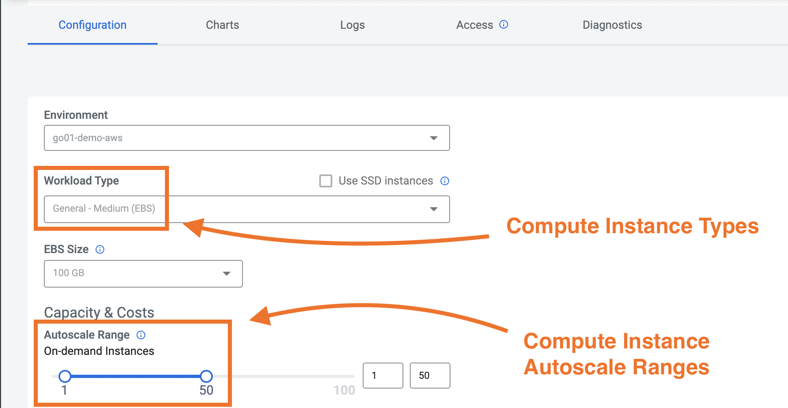

To learn more about other important service configurations please visit the CDE Documentation.

Navigate back to the Administration page and open a Virtual Cluster's Cluster Details page.

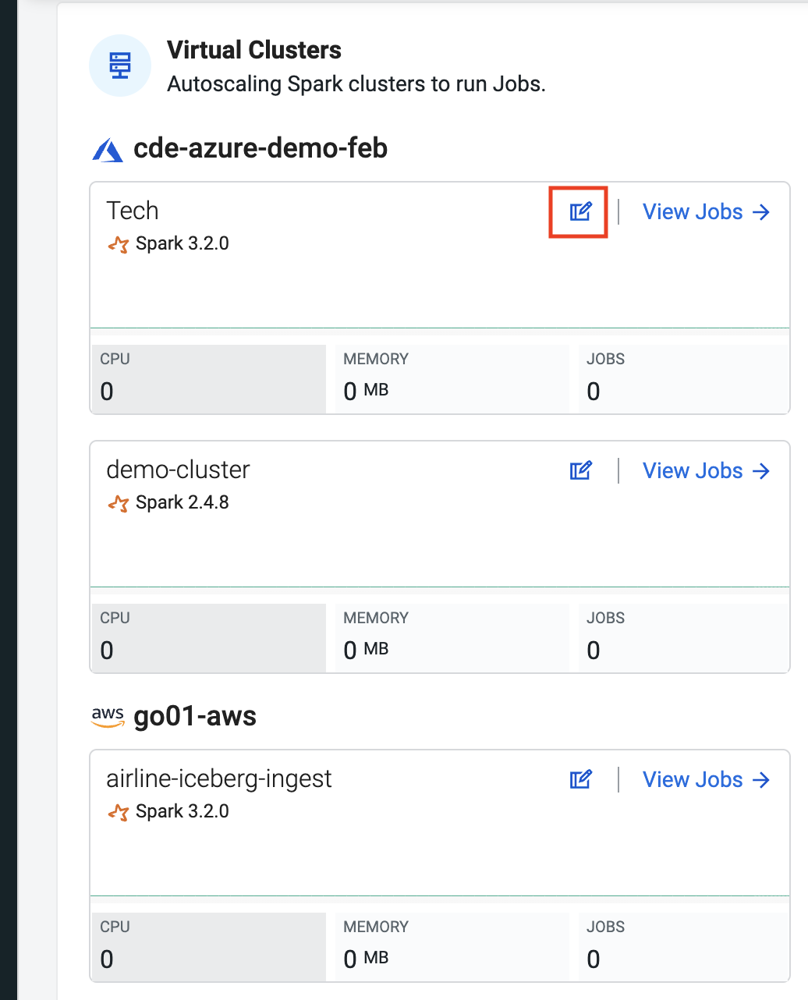

This view includes other important cluster management information. From here you can:

* Download the CDE CLI binaries. The CLI is recommended to submit jobs and interact with CDE. It is covered in Part 3 of this guide.
* Visit the API Docs to learn the CDE API and build sample requests on the Swagger page.
* Access the Airflow UI to monitor your Airflow Jobs, set up custom connections, variables, and more.  

Open the Configuration tab. Notice that CPU and Memory autoscale ranges, Spark version, and Iceberg options are set here.

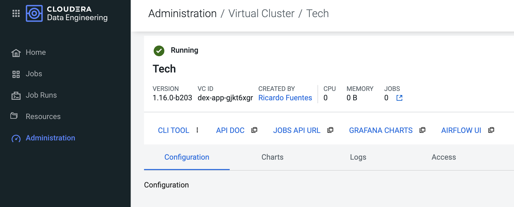

To learn more about other important service configurations please visit the CDE Documentation.

>**Note**  
>A CDE Service defines compute instance types, instance autoscale ranges and the associated CDP Data Lake. The Data and Users associated with the Service are constrained by SDX and the CDP Environment settings.

>**Note**  
> Within a CDE Service you can deploy one or more CDE Virtual Clusters. The Service Autoscale Range is a count of min/max allowed Compute Instances while the Virtual Cluster Autoscale Range is the min/max CPU and Memory that can be utilized within the Compute Instance range. The Cluster's range is the total CPU and Memory available to the Spark jobs running within the cluster.

>**Note**  
> This flexible architecture allows you to isolate your workloads and limit access within different autoscaling compute clusters while predefining cost management guardrails at an aggregate level. For example, you can define Services at an organization level and Virtual Clusters within them as DEV, QA, PROD, etc.

>**Note**  
>CDE takes advantage of YuniKorn resource scheduling and sorting policies, such as gang scheduling and bin packing, to optimize resource utilization and improve cost efficiency. For more information on gang scheduling, see the Cloudera blog post [Spark on Kubernetes – Gang Scheduling with YuniKorn](https://blog.cloudera.com/spark-on-kubernetes-gang-scheduling-with-yunikorn/).

>**Note**  
>CDE Spark Job auto-scaling is controlled by Apache Spark dynamic allocation. Dynamic allocation scales job executors up and down as needed for running jobs. This can provide large performance benefits by allocating as many resources as needed by the running job, and by returning resources when they are not needed so that concurrent jobs can potentially run faster.


## Part 1: Implement a Spark Pipeline

#### Summary

In this section you will execute four Spark jobs from the CDE UI. You will store files and python virtual environments in CDE Resources, migrate Spark tables to Iceberg tables, and use some of Iceberg's most awaited features including Time Travel, Incremental Queries, Partition and Schema Evolution.

#### Recommendations Before you Start

>**⚠ Warning**  
> Throughout the labs, this guide will instruct you to make minor edits to some of the scripts. Please be prepared to make changes in an editor and re-upload them to the same CDE File Resource after each change. Having all scripts open at all times in an editor such as Atom is highly recommended.

>**⚠ Warning**  
> Your Cloudera ACE Workshop Lead will load the required datasets to Cloud Storage ahead of the workshop. If you are reproducing these labs on your own, ensure you have placed all the contents of the data folder in a Cloud Storage path of your choice.

>**⚠ Warning**  
> Each attendee will be assigned a username and cloud storage path. Each script will read your credentials from "parameters.conf" which you will have placed in your CDE File Resource. Before you start the labs, open the "parameters.conf" located in the "resources_files" folder and edit all three fields with values provided by your Cloudera ACE Workshop Lead. If you are reproducing these labs on your own you will also have to ensure that these values reflect the Cloud Storage path where you loaded the data.

#### Editing Files and Creating CDE Resources

CDE Resources can be of type "File", "Python", or "Custom Runtime". You will start by creating a resource of type file to store all Spark and Airflow files and dependencies and then a Python Resource to utilize custom Python libraries in a CDE Spark Job run.

To create a File Resource, from the CDE Home Page click on "Create New" in the "Resources" -> "File" section.

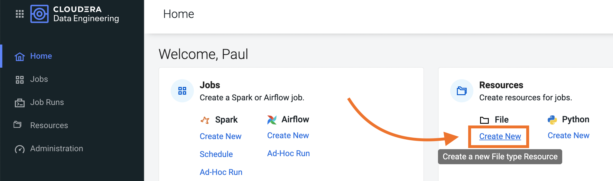

Pick your Spark 3 / Iceberg-enabled CDE Virtual Cluster and name your Resource after your username or a unique ID.

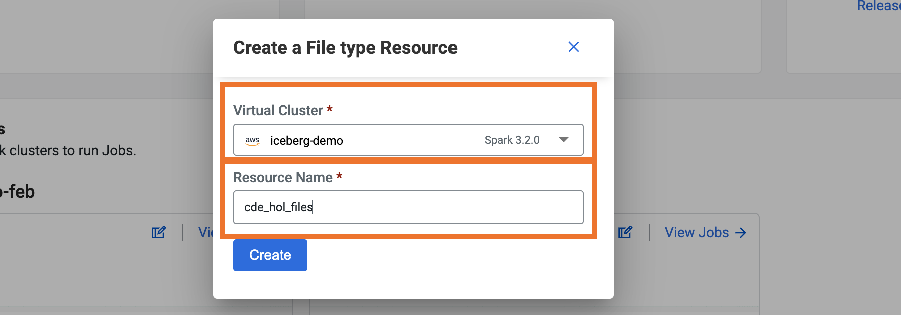

Upload all files from the "cde_ace_hol/cde_spark_jobs" folder. Then, navigate back to the Resources tab, reopen the resource and upload the two Airflow DAGs located in the "cde_ace_hol/cde_airflow_jobs" folders. Finally, reopen the resource and upload the "utils.py" file contained in the "cde_ace_hol/resources_files" folder.

When you are done, ensure that the following files are located in your File Resource:

```
01_Pre_Setup.py
02_EnrichData_ETL.py
03_Spark2Iceberg.py
04_Sales_Report.py
05-A-ETL.py
05-B-Resports.py
06-pyspark-sql.py
07-A-pyspark-LEFT.py
07-B-pyspark-RIGHT.py
07-C-pyspark-JOIN.py
05-Airflow-Basic-Dag.py
07-Airflow-Logic-Dag.py
parameters.conf
utils.py
```

To create a Python Resource, navigate back to the CDE Home Page and click on "Create New" in the "Resources" -> "Python" section.

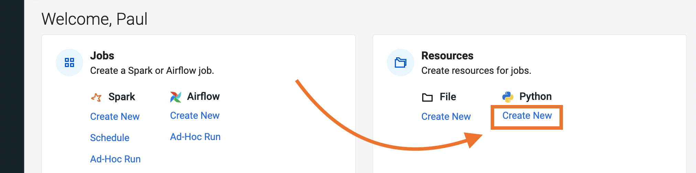

Ensure to select the same CDE Virtual Cluster. Name the Python CDE Resource and leave the pipy mirror field blank.

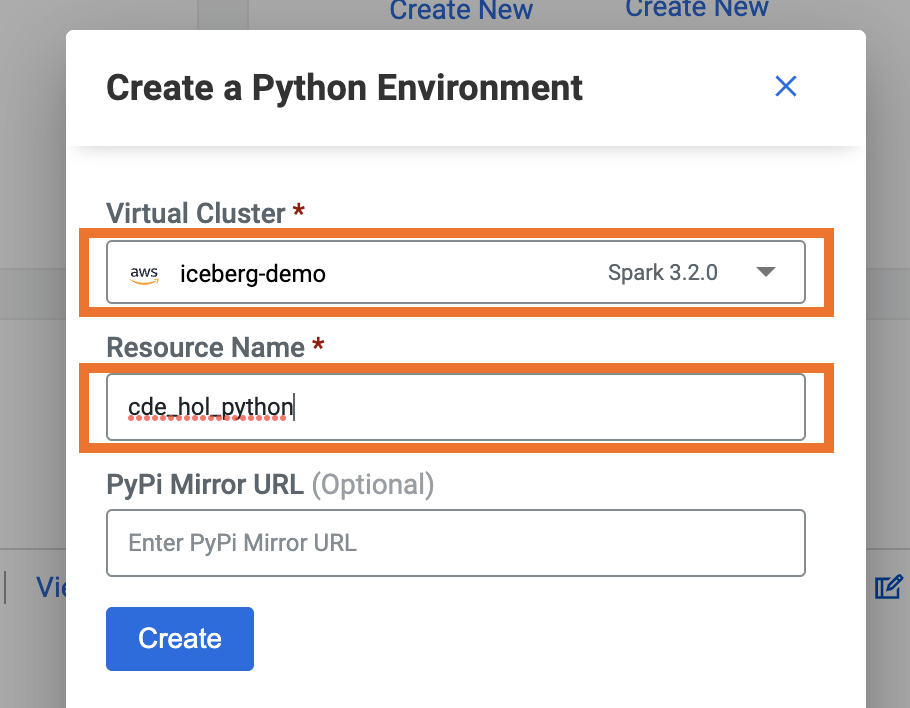

Upload the "requirements.txt" file provided in the "cde_ace_hol/resources_files" folder.


Notice the CDE Resource is now building the Python Virtual Environment. After a few moments the build will complete and you will be able to validate the libraries used.

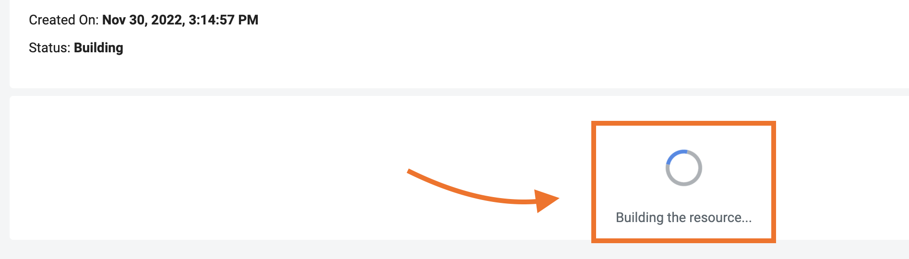

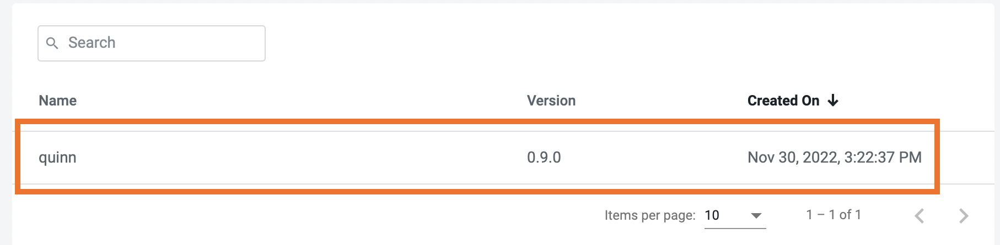


#### Creating CDE Spark Jobs

Next we will create four CDE Jobs of type Spark using scripts "01_Pre_Setup.py", "02_EnrichData_ETL.py", "03_Spark2Iceberg.py" and "04_Sales_Report.py" located in the "cde_ace_hol/cde_spark_jobs" folder.

Navigate back to the CDE Home Page. Click on "Create New" in the "Jobs" -> "Spark" section.

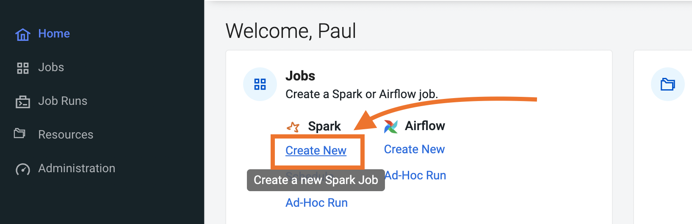

Select your CDE Virtual Cluster and assign "O1_Setup" as the Job Name.

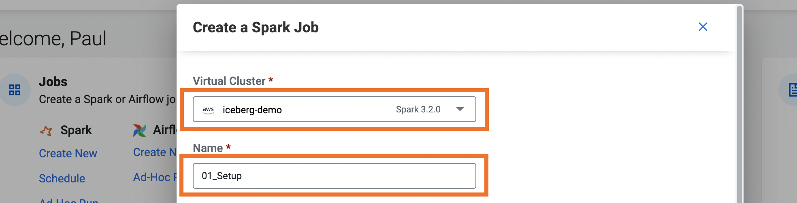

Scroll down; ensure to select "File" from the radio button and click on "Select from Resource" in the "Application File" section. A window will open with the contents loaded in your File Resource. Select script "01_Pre_Setup.py".

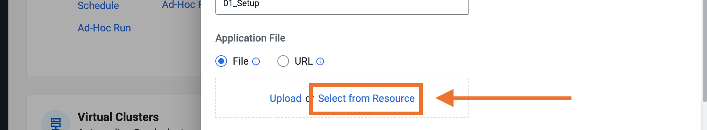

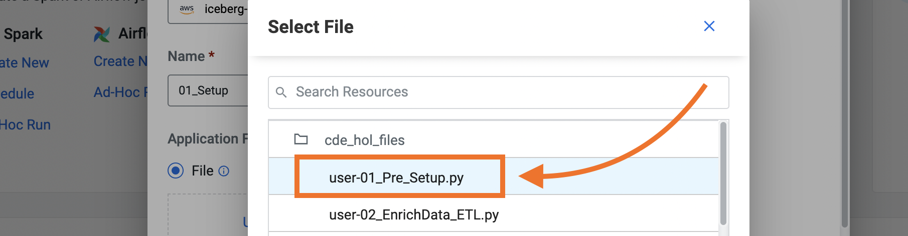

Scroll down again to the "Resources" section and notice that your File Resource has been mapped to the Job by default. This allows the PySpark script to load modules in the same Resource such as the ones contained in the "utils.py" file.

Scroll to the bottom and click on the "Create and Run" blue icon.

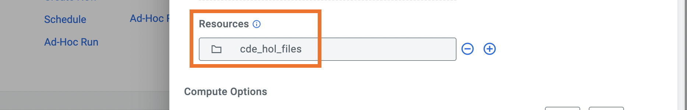

You will be automatically taken to the Jobs tab where the Job will now be listed at the top. Open the Job Runs tab on the left pane and validate that the CDE Spark Job is executing.

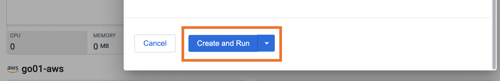

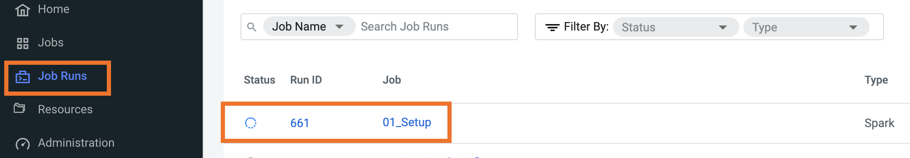

When complete, a green checkmark will appear on the left side. Click on the Job Run number to explore further.

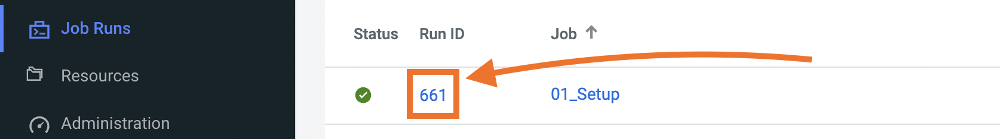

The Job Run is populated with Metadata, Logs, and the Spark UI. This information is persisted and can be referenced at a later point in time.

The Configuration tab allows you to verify the script and resources used by the CDE Spark Job.

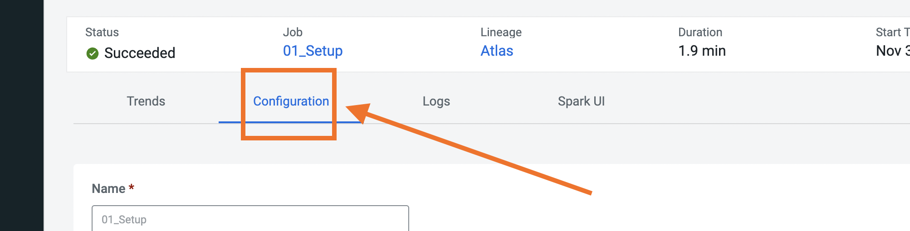

The Logs tab contains rich logging information. For example, you can verify your code output under "Logs" -> "Driver" -> "StdOut".

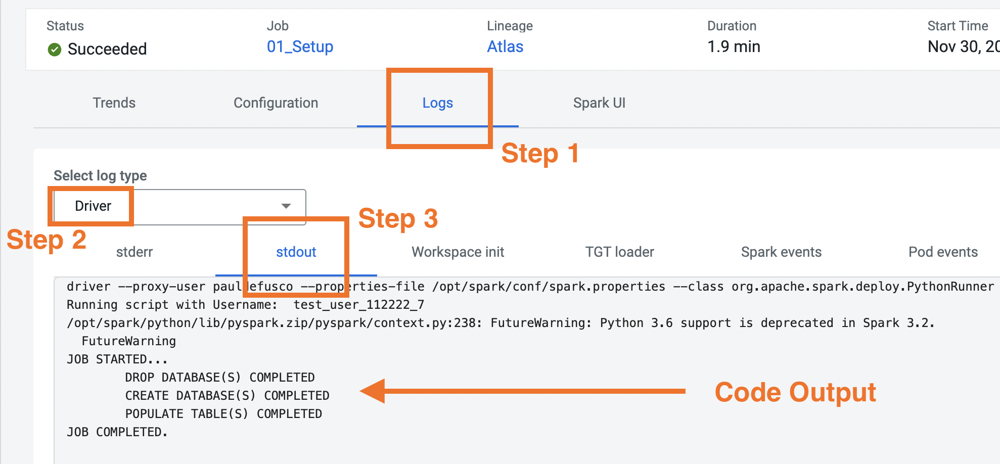

The Spark UI allows you to visualize resources, optimize performance and troubleshoot your Spark Jobs.

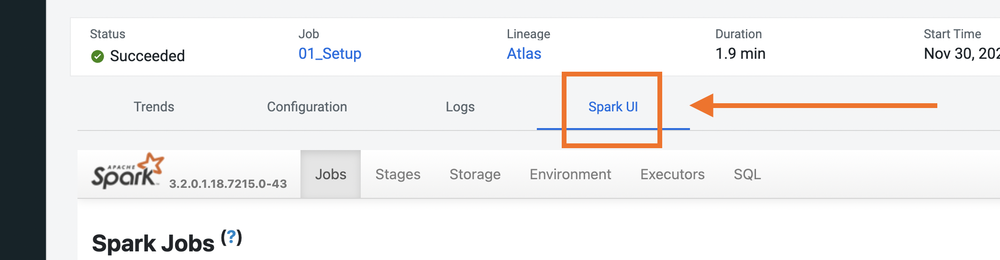

Now that you have learned how to create a CDE Spark Job with the CDE UI, repeat the same process with the following scripts and settings. Leave all other options to their default. Allow each job to complete before creating and executing a new one.

```
Job Name: 02_EnrichData_ETL
Type: Spark
Application File: 02_EnrichData_ETL.py
Resource(s): cde_hol_files (or your File Resource name if you used a different one)

Job Name: 03_Spark2Iceberg
Type: Spark
Application File: 03_Spark2Iceberg.py
Resource(s): cde_hol_files

Job Name: 04_Sales_Report
Type: Spark
Python Environment: cde_hol_python
Application File: 04_Sales_Report.py
Job Resource(s): cde_hol_files
```

>**Note**  
>Your credentials are stored in parameters.conf

>**Note**  
>The Iceberg Jars did not have to be loaded in the Spark Configurations. Iceberg is enabled at the Virtual Cluster level.

>**Note**  
>Job 04_Sales_Report uses the Quinn Python library. The methods are implemented in utils.py which is loaded via the File Resource.   


## Part 2: Orchestrating Pipelines with Airflow

#### Summary

In this section you will build three Airflow jobs to schedule, orchestrate and monitor the execution of Spark Jobs and more.

##### Airflow Concepts

In Airflow, a DAG (Directed Acyclic Graph) is defined in a Python script that represents the DAGs structure (tasks and their dependencies) as code.

For example, for a simple DAG consisting of three tasks: A, B, and C. The DAG can specify that A has to run successfully before B can run, but C can run anytime. Also that task A times out after 5 minutes, and B can be restarted up to 5 times in case it fails. The DAG might also specify that the workflow runs every night at 10pm, but should not start until a certain date.

For more information about Airflow DAGs, see Apache Airflow documentation [here](https://airflow.apache.org/docs/apache-airflow/stable/concepts/dags.html). For an example DAG in CDE, see CDE Airflow DAG documentation [here](https://docs.cloudera.com/data-engineering/cloud/orchestrate-workflows/topics/cde-airflow-editor.html).

The Airflow UI makes it easy to monitor and troubleshoot your data pipelines. For a complete overview of the Airflow UI, see  Apache Airflow UI documentation [here](https://airflow.apache.org/docs/apache-airflow/stable/ui.html).

##### Executing Airflow Basic DAG

Open "05-Airflow-Basic-DAG.py", familiarize yourself with the code, and notice the following:

* Airflow allows you to break up complex Spark Pipelines in different steps, isolating issues and optionally providing retry options.
* The CDEJobRunOperator, BashOperator and PythonOperator are imported at lines 44-46. These allow you to execute a CDE Spark Job, Bash, and Python Code respectively all within the same workflow.
* Each code block at lines 74, 80, 86, 92 and 102 instantiates an Operator. Each of them is stored as a variable named Step 1 through 5.
* Step 2 and 3 are CDEJobRunOperator instances and are used to execute CDE Spark Jobs. At lines 77 and 83 the CDE Spark Job names have to be declared as they appear in the CDE Jobs UI. In this case, the fields are referencing two variables at lines 52 and 53.
* Finally, task dependencies are specified at line 109. Steps 1 - 5 are executed in sequence, one when the other completes. If any of them fails, the remaining CDE Jobs will not be triggered.

Create two CDE Spark Jobs using scripts "05-A-ETL.py" and "05-B-Reports.py" but do not run them.

Then, open "05-Airflow-Basic-DAG.py" and enter the names of the two CDE Spark Jobs as they appear in the CDE Jobs UI at lines 52 and 53.

In addition, notice that credentials stored in parameters.conf are not available to CDE Airflow jobs. Therefore, update the username field at line 48 in "05-Airflow-Basic-DAG.py".

The username variable will be used at line 64 to create a dag_name variable which in turn will be used at line 67 to assign a unique DAG name when instantiating the DAG object.

Finally, modify lines 60 and 61 to assign a start and end date that takes place in the future.

>**⚠ Warning**  
>CDE requires a unique DAG name for each CDE Airflow Job or will otherwise return an error upon job creation.

>**⚠ Warning**   
> If you don't assign a future start and end date, the CDE Airflow Job will execute twice upon creation. You will thus have a duplicate of each CDE Spark Job running concurrently.  

Upload the updated script to your CDE Files Resource. Then navigate back to the CDE Home Page and create a new CDE Job of type Airflow.

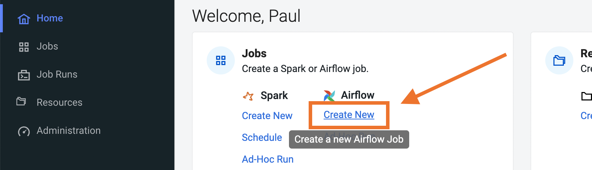

As before, select your Virtual Cluster and Job name. Then create and execute.

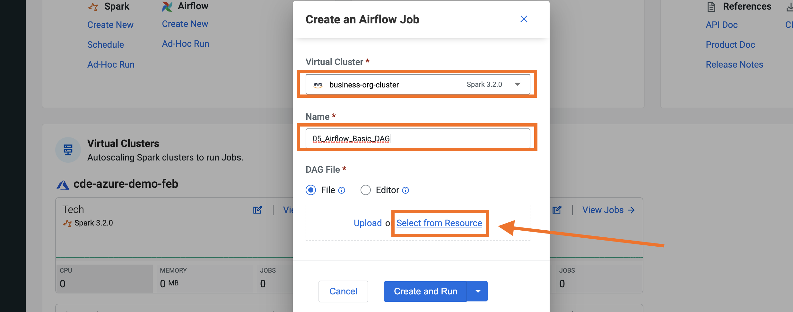

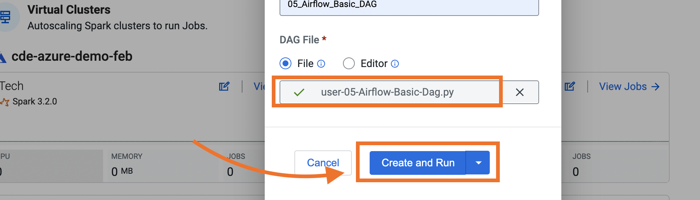

Navigate to the Job Runs tab and notice that the Airflow DAG is running. While in progress, navigate back to the CDE Home Page, scroll down to the Virtual Clusters section and open the Virtual Cluster Details. Then, open the Airflow UI.

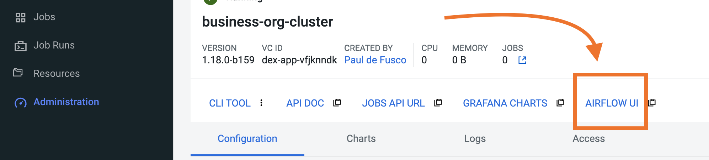

Familiarize yourself with the Airflow UI. Then, open the Dag Runs page and validate the CDE Airflow Job's execution.

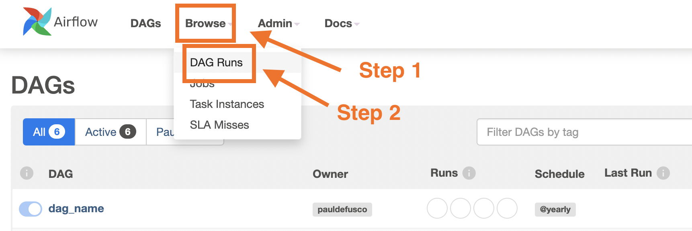

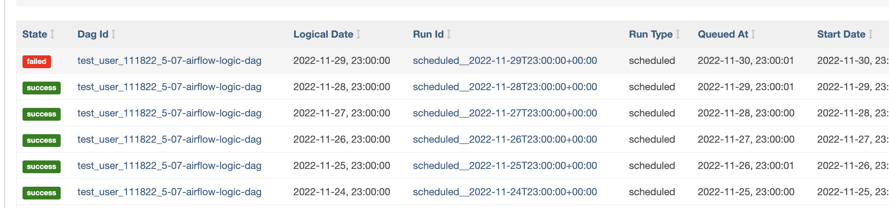


##### Executing Airflow Logic Dag

Airflow's capabilities include a wide variety of operators, the ability to store temporary context values, connecting to 3rd party systems and overall the ability to implement more advanced orchestration use cases.

Using "07-Airflow-Logic-DAG.py" you will create a new CDE Airflow Job with other popular Operators such as the SimpleHttpOperator Operator to send/receive API requests.

In order to use it, first you have to set up a Connection to the endpoint referenced at line 110 in the DAG. Navigate back to the CDE Administration tab, open your Virtual Cluster's "Cluster Details" and then click on the "Airflow" icon to reach the Airflow UI.

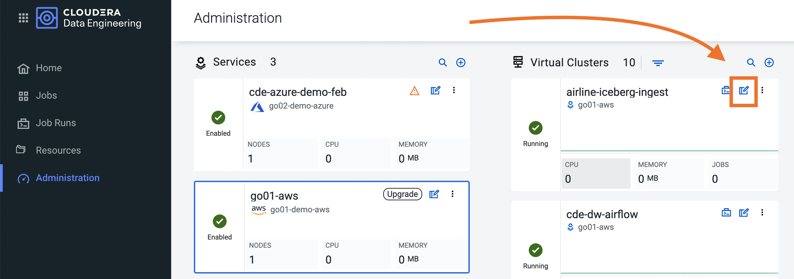

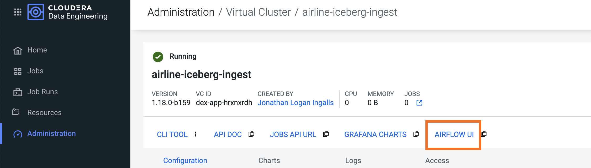

Open Airflow Connections under the Admin dropdown as shown below.


Airflow Connections allow you to predefine connection configurations so that they can be referenced within a DAG for various purposes. In our case, we will create a new connection to access the "Random Joke API" and in particular the "Programming" endpoint.

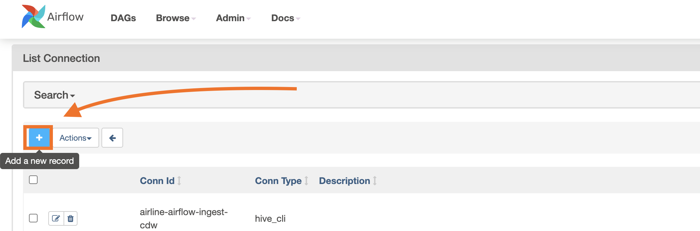

Fill out the following fields as shown below and save.

```
Connection Id: random_joke_connection
Connection Type: HTTP
Host: https://official-joke-api.appspot.com/
```

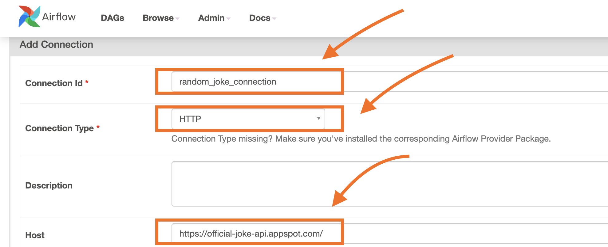

Now open "07-Airflow-Logic-DAG.py" and familiarize yourself with the code. Some of the most notable aspects of this DAG include:

* Review line 127. Task Execution no longer follows a linear sequence. Step 3 only executes when both Step 1 and 2 have completed successfully.
* At lines 75-77, the DummyOperator Operator is used as a placeholder and starting place for Task Execution.
* At lines 106-115, the SimpleHttpOperator Operator is used to send a request to an API endpoint. This provides an optional integration point between CDE Airflow and 3rd Party systems or other Airflow services as requests and responses can be processed by the DAG.
* At line 109 the connection id value is the same as the one used in the Airflow Connection you just created.
* At line 110 the endpoint value determines the API endpoint your requests will hit. This is appended to the base URL you set in the Airflow Connection.
* At line 112 the response is captured and parsed by the "handle_response" method specified between lines 98-104.
* At line 114 we use the "do_xcom_push" option to write the response as a DAG context variable. Now the response is temporarily stored for the duration of the Airflow Job and can be reused by other operators.
* At lines 120-124 the Python Operator executes the "_print_random_joke" method declared at lines 117-118 and outputs the response of the API call.

As in the previous example, first create (but don't run) three CDE Spark Jobs using "07_A_pyspark_LEFT.py", "07_B_pyspark_RIGHT.py" and  "07_C_pyspark_JOIN.py".

Then, open "07-Airflow-Logic-DAG.py" in your editor and update your username at line 50. Make sure that the job names at lines 54 - 56 reflect the three CDE Spark Job names as you entered them in the CDE Job UI.

Finally, reupload the script to your CDE Files Resource. Create a new CDE Job of type Airflow and select the script from your CDE Resource.

>**Note**
>The SimpleHttpOperator Operator can be used to interact with 3rd party systems and exchange data to and from a CDE Airflow Job run. For example you could trigger the execution of jobs outside CDP or execute CDE Airflow DAG logic based on inputs from 3rd party systems.

>**Note**  
>You can use CDE Airflow to orchestrate SQL queries in CDW, the Cloudera Data Warehouse Data Service, with the Cloudera-supported  CDWOperator. If you want to learn more, please go to [Bonus Lab 1: Using CDE Airflow with CDW](https://github.com/pdefusco/CDE_Tour_ACE_HOL/blob/main/step_by_step_guides/english.md#bonus-lab-1-using-cde-airflow-with-cdw).

>**Note**  
>Additionally, other operators including Python, HTTP, and Bash are available in CDE. If you want to learn more about Airflow in CDE, please reference [Using CDE Airflow](https://github.com/pdefusco/Using_CDE_Airflow).


## Part 3: Using the CDE CLI

#### Summary

The majority of CDE Production use cases rely on the CDE API and CLI. With them, you can easily interact with CDE from a local IDE and build integrations with external 3rd party systems. For example, you can implement multi-CDE cluster workflows with GitLabCI or Python.  

In this part of the workshop you will gain familiarity with the CDE CLI by rerunning the same jobs and interacting with the service remotely.

You can use the CDE CLI or API to execute Spark and Airflow jobs remotely rather than via the CDE UI as shown up to this point. In general, the CDE CLI is recommended over the UI when running spark submits from a local machine. The API is instead recommended when integrating CDE Spark Jobs or Airflow Jobs (or both) with 3rd party orchestration systems. For example you can use GitLab CI to build CDE Pipelines across multiple Virtual Clusters. For a detailed example, please reference [GitLab2CDE](https://github.com/pdefusco/Gitlab2CDE).

##### Manual CLI Installation

You can download the CDE CLI to your local machine following the instructions provided in the [official documentation](https://docs.cloudera.com/data-engineering/cloud/cli-access/topics/cde-cli.html).

##### Automated CLI Installation

Alternatively, you can use the "00_cde_cli_install.py" automation script located in the "cde_cli_jobs" folder. This will install the CDE CLI in your local machine if you have a Mac.

First, create a Python virtual environment and install the requirements.

```
#Create
python3 -m venv venv

#Activate
source venv/bin/activate

#Install requirements
pip install -r requirements.txt #Optionally use pip3 install
```

Then, execute the script with the following commands:

```
python cde_cli_jobs/00_cde_cli_install.py JOBS_API_URL CDP_WORKLOAD_USER
```

#### CLI Steps

###### Run Spark Job:

This command will run the script as a simple Spark Submit. This is slightly different from creating a CDE Job of type Spark as the Job definition will not become reusable.

```
cde spark submit --conf "spark.pyspark.python=python3" cde_cli_jobs/01_pyspark-sql.py
```

###### Check Job Status:

This command will allow you to obtain information related to the above spark job. Make sure to replace the id flag with the id provided when you executed the last script e.g. 199.

```
cde run describe --id 199
```

###### Review the Output:

This command shows the logs for the above job. Make sure to replace the id flag with the id provided when you executed the last script.  

```
cde run logs --type "driver/stdout" --id 199
```

###### Create a CDE Resource:

This command creates a CDE Resource of type File:

```
cde resource create --name "my_CDE_Resource"
```

###### Upload file(s) to resource:

This command uploads the "01_pyspark-sql.py" script into the CDE Resource.

```
cde resource upload --local-path "cde_cli_jobs/01_pyspark-sql.py" --name "my_CDE_Resource"
```

###### Validate CDE Resource:

This command obtains information related to the CDE Resource.

```
cde resource describe --name "my_CDE_Resource"
```

###### Schedule CDE Spark Job with the File Uploaded to the CDE Resource

This command creates a CDE Spark Job using the file uploaded to the CDE Resource.

```
cde job create --name "PySparkJob_from_CLI" --type spark --conf "spark.pyspark.python=python3" --application-file "/app/mount/01_pyspark-sql.py" --cron-expression "0 */1 * * *" --schedule-enabled "true" --schedule-start "2022-11-28" --schedule-end "2023-08-18" --mount-1-resource "my_CDE_Resource"
```

###### Validate Job:

This command obtains information about CDE Jobs whose name contains the string "PySparkJob".

```
cde job list --filter 'name[like]%PySparkJob%'
```

###### Learning to use the CDE CLI

The CDE CLI offers many more commands. To become familiarized with it you can use the "help" command and learn as you go. Here are some examples:

```
cde --help
cde job --help
cde run --help
cde resource --help
```

To learn more about migrating Spark and Airflow to CDE, please refer to the Migration Guide from the official documentation.


## Bonus Labs

So far you explored the core aspects of CDE Spark, Airflow and Iceberg. The following labs give you an opportunity to explore CDE in more detail.

Each Bonus Lab can be run independently of another. In other words, you can run all or just a select few, and in any order that you prefer.


### Bonus Lab 1: Using CDE Airflow with CDW

You can use the CDWRunOperator to run CDW queries from a CDE Airflow DAG. This operator has been created and is fully supported by Cloudera.

##### CDW Setup Steps

Before we can use the operator in a DAG you need to establish a connection between CDE Airflow to CDW. To complete these steps, you must have access to a CDW virtual warehouse.

CDE currently supports CDW operations for ETL workloads in Apache Hive virtual warehouses. To determine the CDW hostname to use for the connection:

Navigate to the Cloudera Data Warehouse Overview page by clicking the Data Warehouse tile in the Cloudera Data Platform (CDP) management console.

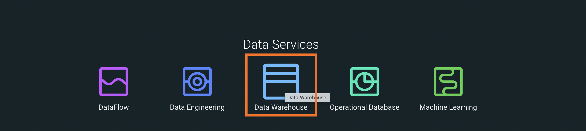

In the Virtual Warehouses column, find the warehouse you want to connect to.

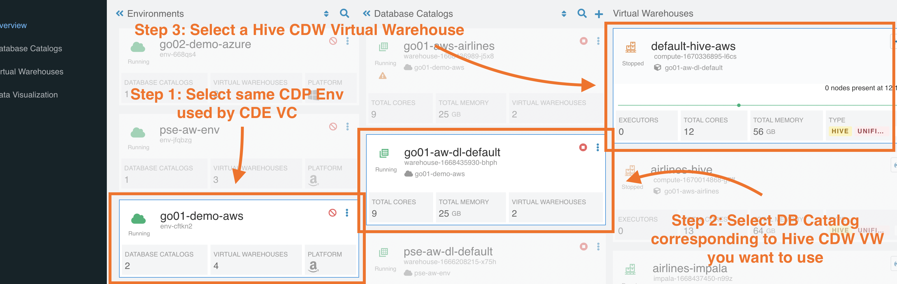

Click the three-dot menu for the selected warehouse, and then click Copy JDBC URL.

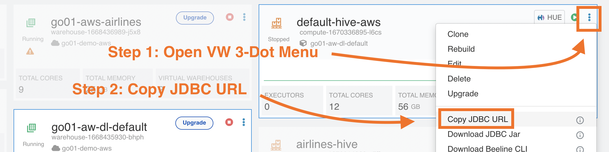

Paste the URL into a text editor, and make note of the hostname. For example, starting with the following url the hostname would be:

```
Original URL: jdbc:hive2://hs2-aws-2-hive.env-k5ip0r.dw.ylcu-atmi.cloudera.site/default;transportMode=http;httpPath=cliservice;ssl=true;retries=3;

Hostname: hs2-aws-2-hive.env-k5ip0r.dw.ylcu-atmi.cloudera.site
```

##### CDE Setup Steps

Navigate to the Cloudera Data Engineering Overview page by clicking the Data Engineering tile in the Cloudera Data Platform (CDP) management console.

In the CDE Services column, select the service containing the virtual cluster you are using, and then in the Virtual Clusters column, click  Cluster Details for the virtual cluster. Click AIRFLOW UI.

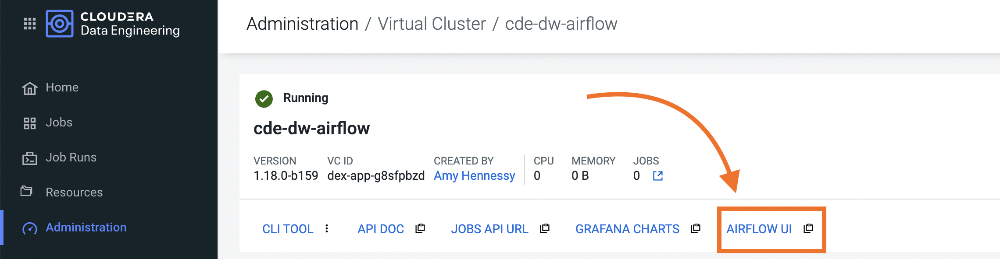

From the Airflow UI, click the Connection link from the Admin tab.

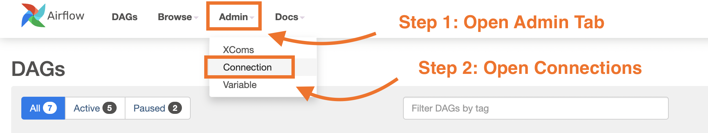

Click the plus sign to add a new record, and then fill in the fields:

* Conn Id: Create a unique connection identifier, such as "cdw_connection".
* Conn Type: Select Hive Client Wrapper.
* Host: Enter the hostname from the JDBC connection URL. Do not enter the full JDBC URL.
* Schema: default
* Login: Enter your workload username and password.

6. Click Save.

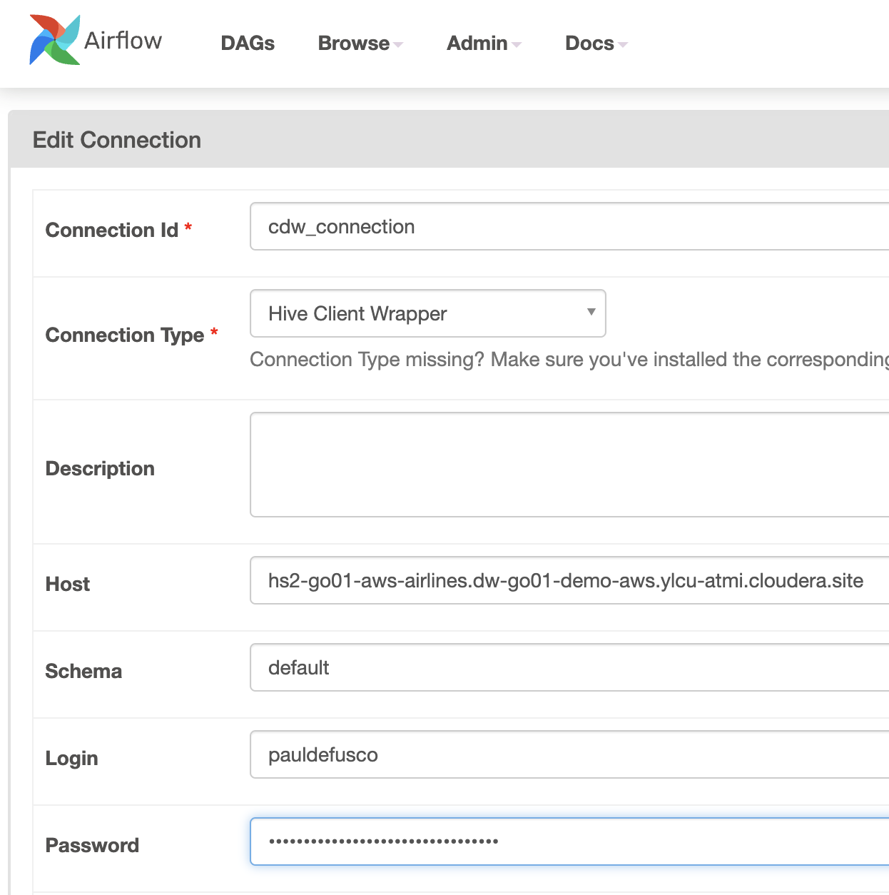

##### Editing the DAG Python file

Now you are ready to use the CDWOperator in your Airflow DAG. Open the "bonus-01_Airflow_CDW.py" script and familiarize yourself with the code.

The Operator class is imported at line 47.

```
from cloudera.cdp.airflow.operators.cdw_operator import CDWOperator
```

An instance of the CDWOperator class is created at lines 78-86.

```
cdw_query = """
show databases;
"""

dw_step3 = CDWOperator(
    task_id='dataset-etl-cdw',
    dag=example_dag,
    cli_conn_id='cdw_connection',
    hql=cdw_query,
    schema='default',
    use_proxy_user=False,
    query_isolation=True
)
```

Notice that the SQL syntax run in the CDW Virtual Warehouse is declared as a separate variable and then passed to the Operator instance as an argument. The Connection is also passed as an argument at line

Finally, notice that task dependencies include both the spark and dw steps:

```
spark_step >> dw_step
```

Next, create a new Airflow CDE Job named "CDW Dag". Upload the new DAG file to the same or a new CDE resource as part of the creation process.

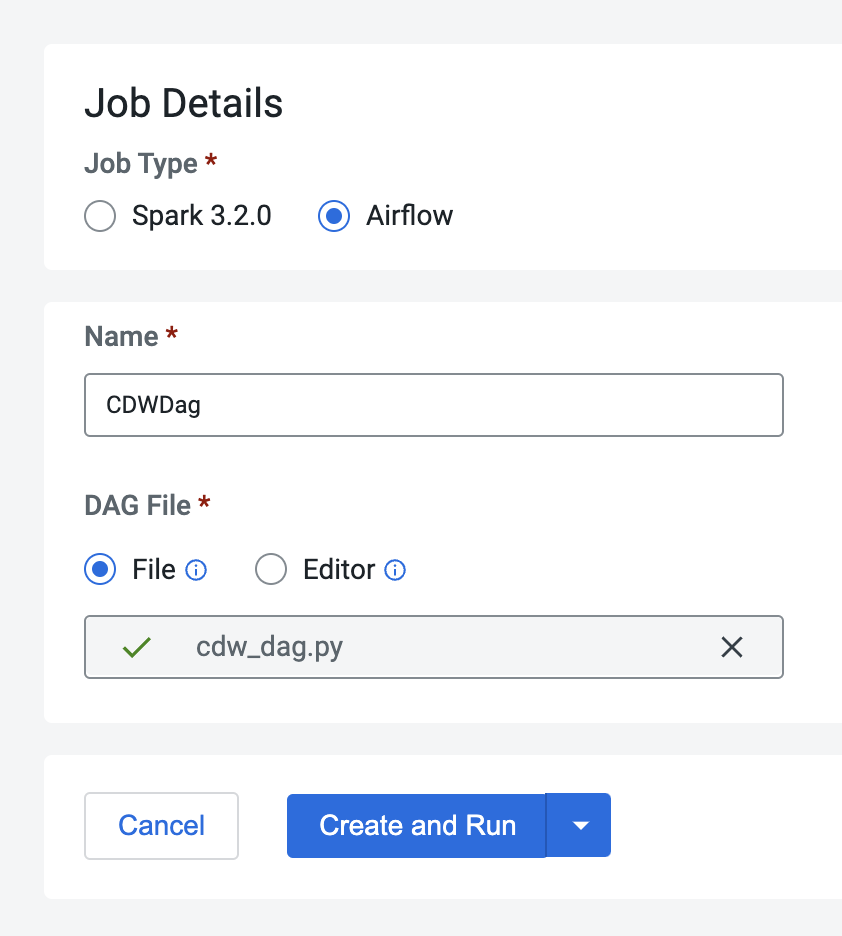

Navigate to the CDE Job Runs Page and open the run's Airflow UI. Then open the Tree View and validate that the job has succeeded.

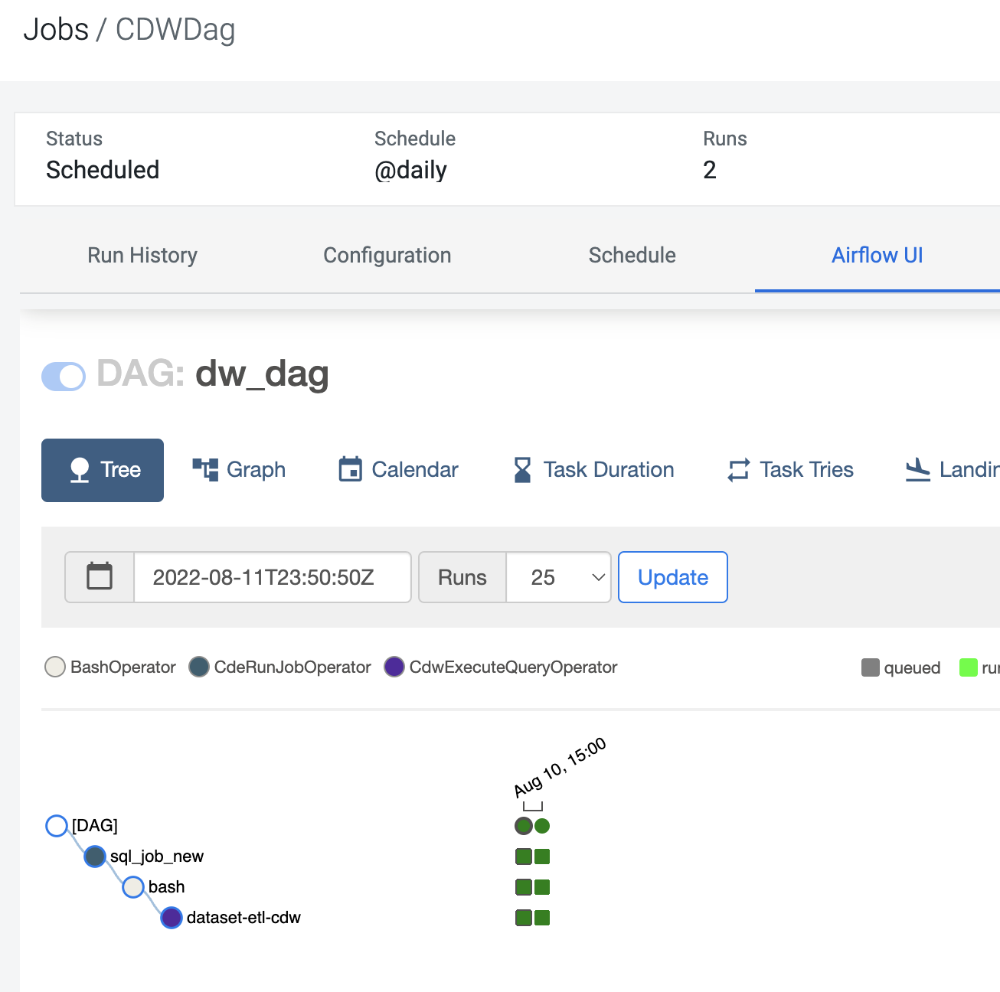


### Bonus Lab 2: Using the CDE Airflow Editor to Build Airflow DAGs without Coding

You can use the CDE Airflow Editor to build DAGs without writing code. This is a great option if your DAG consists of a long sequence of CDE Spark or CDW Hive jobs.

From the CDE Jobs UI, create a new CDE Job of type Airflow as shown below. Ensure to select the "Editor" option. Then click create.

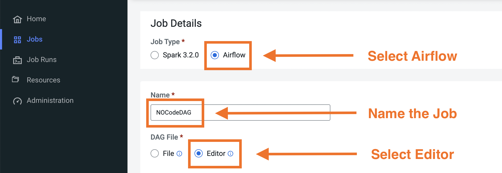

From the Editor Canvas drag and drop the Shell Script action. This is equivalent to instantiating the BashOperator. Click on the icon on the canvas and an option window will appear on the right side. Enter the "dag start" in the Bash Command section.


From the Canvas, drop two CDE Job Actions. Configure them with Job Name "sql_job". You already created this CDE Spark Job in part 2.

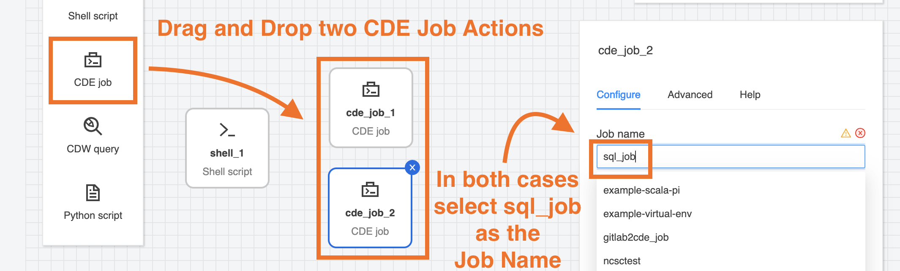

Next, drag and drop a Python action. In the code section, add *print("DAG Terminated")* as shown below.

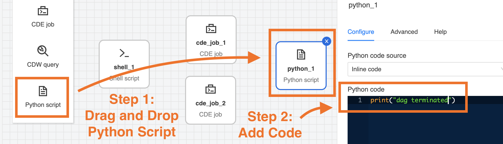

Finally, complete the DAG by connecting each action.

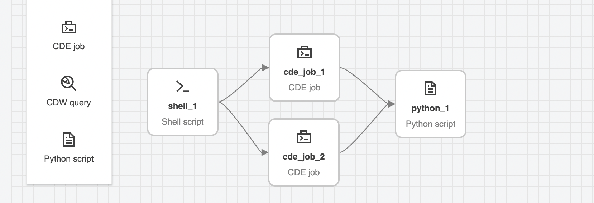

For each of the two CDE Jobs, open the action by clicking on the icon on the canvas. Select "Depends on Past" and then "all_success" in the "Trigger Rule" section.

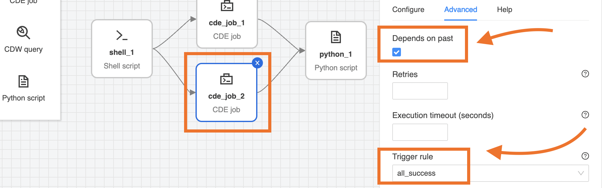

Execute the DAG and observe it from the CDE Job Runs UI.

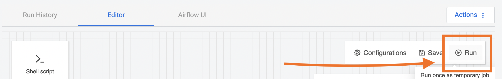

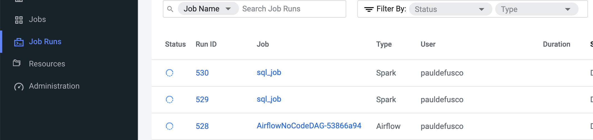


### Conclusion

Congratulations for making it to the end of this tutorial! We hope you enjoyed using CDE first hand. We recommend visiting the [Next Steps Section](https://github.com/pdefusco/CDE_Tour_ACE_HOL#next-steps) to continue your journey with CDE.

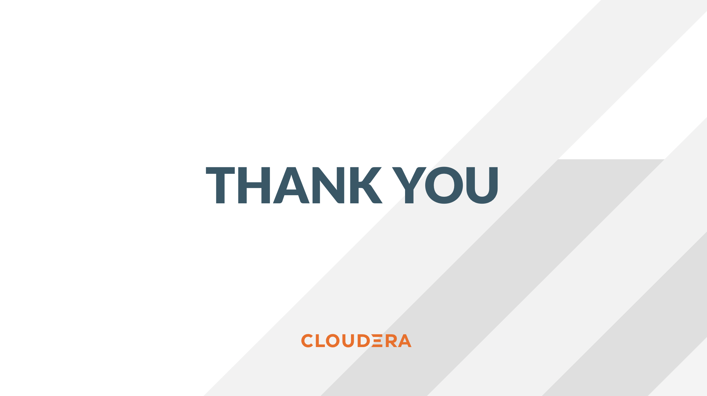
